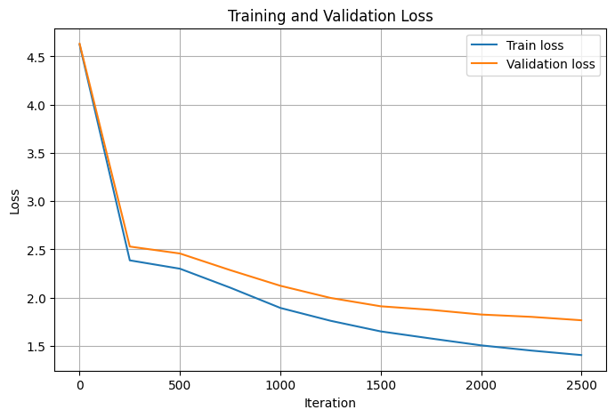

# German GPT from Scratch (PyTorch)

A minimal implementation of a GPT-style decoder-only Transformer language model built from scratch in PyTorch.
The model is trained on a German text corpus and uses character-level tokenization.

---

## Overview

This project reimplements the core components of a modern autoregressive language model, inspired by nanoGPT, but written entirely from scratch for educational purposes.

The goal is to understand:

* Token and positional embeddings
* Masked self-attention
* Transformer blocks
* Autoregressive next-token prediction
* Training and sampling of a language model

---

##  Model Architecture

The model follows a standard GPT-style pipeline:

```
Token Embedding + Positional Embedding
→ Transformer Blocks (×L)
→ LayerNorm
→ Linear Language Modeling Head
```

Each Transformer block contains:

* Masked multi-head self-attention
* Feed-forward MLP
* Residual connections
* Layer normalization

### Configuration

* Layers: 3
* Heads: 4
* Embedding size: 128
* Context length: 128
* Dropout: 0.2

---

## Dataset

The model is trained on a German-language text corpus:

* Franz Kafka — *Die Verwandlung* (Project Gutenberg)

Character-level tokenization is used, allowing the model to learn:

* German spelling
* punctuation
* sentence structure
* special characters such as ä, ö, ü, and ß

---

## Training

Training is performed using:

* Next-token prediction
* Random minibatch sampling
* AdamW optimizer

Loss is tracked for both training and validation sets.

Example result:

```
Final training loss: ~1.81
Final validation loss: ~1.92
```

---

## Results

### Loss Curve

Saved in:

```
outputs/loss_curve.png
```



### Generated Samples

The model produces German-like text with:

* realistic word structure
* punctuation patterns
* recurring character names

Example:

```
Gregor sagte, daß er sich nicht ganz wohl fühlte und
daß die Schwester ihn betrachtete, während er still
im Zimmer lag und die Gedanken sich verwirrten...
```

(Note: Text is not always grammatically correct due to small model size.)

---

## Project Structure

```
.
├── model.py        # GPT model implementation
├── train.py        # training pipeline
├── generate.py     # text generation script
├── requirements.txt
├── data/
│   └── german_kafka.txt
├── outputs/
│   ├── loss_curve.png
│   └── german_gpt_checkpoint.pt
└── notebooks/
    └── assignment_notebook.ipynb
```

---

## Installation

```bash
pip install -r requirements.txt
```

---

## Usage

### Train the model

```bash
python train.py
```

### Generate text

```bash
python generate.py
```

---

## Discussion

Model performance depends on:

* Model size (layers, heads, embedding dimension)
* Context length
* Training time
* Tokenization granularity

This implementation is intentionally small and simple, so it captures structure but not full semantic coherence.

---

## Disclaimer

This is a **minimal educational implementation**, not a production-ready language model.

---

## Acknowledgment

Conceptual inspiration from:

* nanoGPT by Andrej Karpathy

---

## Notes

This project is for educational purposes.

## Author
**Vasan Iyer**  
Embedded / AI Engineer  
Focus:  Python, AI, LLMs, GPT

GitHub: https://github.com/Vaiy108
